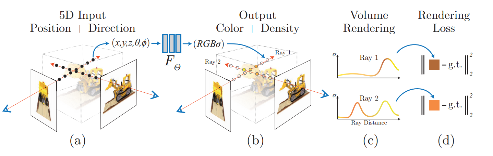
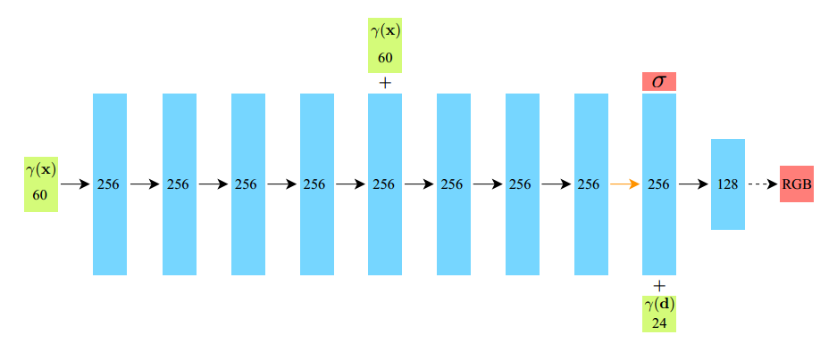

# NeRF

[**PaperSource——NeRF: Representing Scenes as Neural Radiance Fields for View Synthesis**](https://arxiv.org/pdf/2003.08934)

#### 前言：Non-NeRF-based SLAM有什么问题

### 什么是NeRF

**NeRF**的全称是Neural Radiance Fields，即**神经辐射场**

是一种用于三维场景的新视角**重建**方法

> 更具体地说，NeRF是一种利用**神经网络**来**隐式**地表征3D模型（模型的信息被隐式的存储在神经网络中）。神经网络经过训练，可以做到输入新视角后就输出该视角下的图片

### 什么是隐式

- 显式(Explicit Representation): 3D信息在空间上具有<u>**明确的xyz坐标**</u>
> 通常用voxel，点云，网格来表示3d图像

- 隐式(Implicit Representation)：3D信息<u>**没有明确的xyz坐标**</u>，只是输出特定角度下的2D图片

两者的区别：可以用描绘一张地图类比

### NeRF原理

> 概述：NeRF函数是将一个连续的场景表示为一个**输入**为5D向量的函数，包括一个空间点的3D坐标位置x=(x,y,z)，以及方向(θ,ϕ)；**输出**为视角相关的该3D点的颜色c=(r,g,b)，和对应位置（体素）的密度σ

#### 1、Input

NeRF的输入是关于**采样点**的**5D向量**：**（x，y，z，θ，φ）**

- **5D向量**

    - xyz：每一个采样点在世界坐标系下的坐标

    - θ，φ：用于表示每一个采样点所在**射线**的方向

- **采样点**————也可以叫它为**粒子**

    - 在NeRF中，物体都是由可以自己发光的粒子组成的

    - 

    - 对于在空间中的粒子来说，设其坐标为(x,y,z)，相机拍摄的图片上对应的像素坐标(u,v), 两者可以有如下的关系：
    - 
    - 从正向渲染的过程来看，空间中的粒子通过上面相机模型可以变成图片上的像素，假设像素的颜色等于粒子发光的颜色，这时候我们其实可以发现粒子，像素，相机在**同一条射线**上

    - 反过来看，所以知道相机位姿和像素上的点的坐标，可以确定一条射线，这一条射线表示为：_**r(t) = o + td**_
      - > t是距离，d是方向，o是射线原点
    - 像素的颜色可以看作是这条射线上无数个发光点叠加到一起，也就是粒子叠加在一起了，<u>而我们的采样点就是在不同的射线上去采样这些粒子</u>
    - 每次训练的batch可以一张图片多条射线，一条射线采样多个粒子进行训练，原文中是一张图片1024条射线，每条射线采样64个粒子。可见下图
    - 

#### 2、MLP

- 绿色：输入
  - γ(x)63：采样点的位置+采样点xyz每一分量的位置编码
  - γ(d)27：采样点的方向+采样点方向每一分量的位置编码
- 蓝色：网络的隐藏层
- 红色：输出
  - σ：粒子的不透明度值
  - RGB：粒子的颜色值

#### 3、Output

- MLP的输出是每个粒子的不透明度值σ，和颜色值RGB，但会通过**体渲染**的方式生成为一张图片
- 
- **体渲染**

    - 简单理解，就是对同一射线上关于粒子的σ和RGB进行求和
    - 
    - 连续积分模型的公式如下：
    - $$ \hat{C(s)}=\int_{0}^{+\infty} T(s) \sigma(s) C(s) d s $$
      - 其中T(s)是点s之前，光线没有被阻碍地概率
      - σ(s)是点s处，光线被粒子阻碍的概率密度
      - C(s)是点s处，粒子发出的颜色
      - 实际情况为离散，同样可以表示，这里不赘述
    - 这样通过对每条射线上进行积分可以得到该像素处的颜色，从而渲染出图片

#### 4、Loss

- 采用自监督
- 将神经网络的输出，即每条射线上粒子的颜色、不透明度进行求和，作为预测值
- 原图片对应像素的颜色作为GT
- 粒子颜色和与图片像素颜色做MSE：

  - $$L\left(\hat{y}_{i}, \tilde{y}_{i}\right)=\frac{1}{N} \sum_{i=1}^{N}\left(\hat{y}_{i}-\tilde{y}_{i}\right)^{2}$$ 

-  通过最小化损失函数L来优化模型参数,使用梯度下降或其他优化算法来更新模型参数